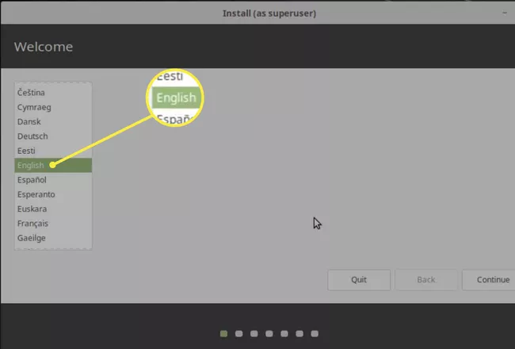
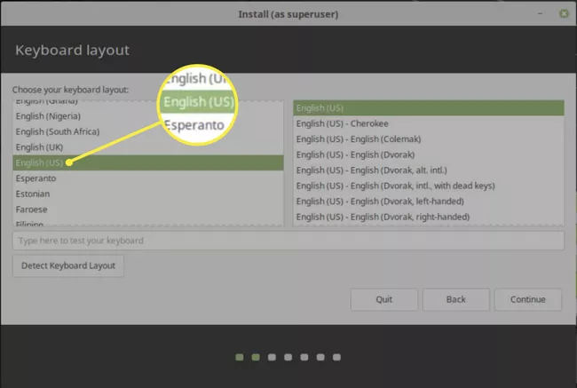
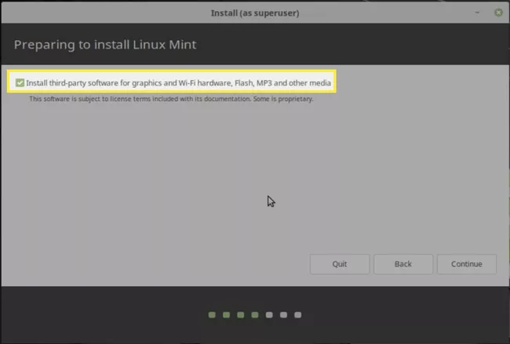
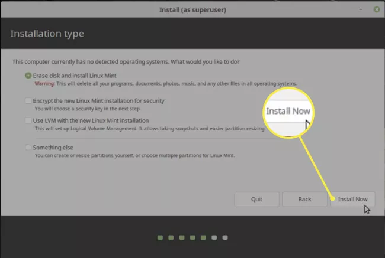
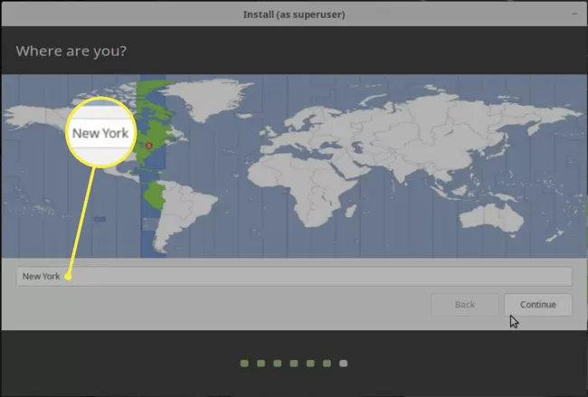
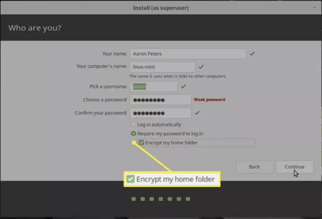
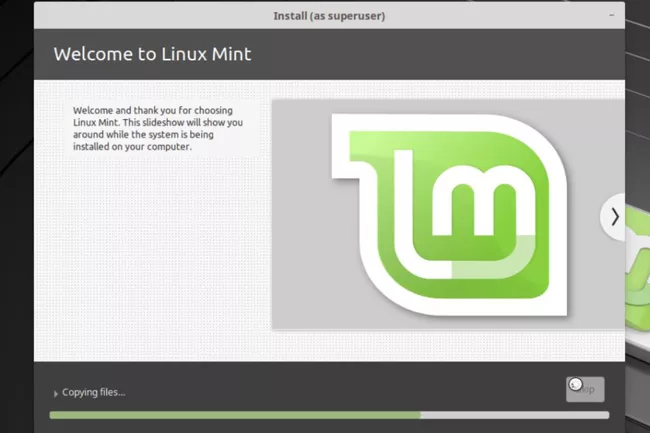
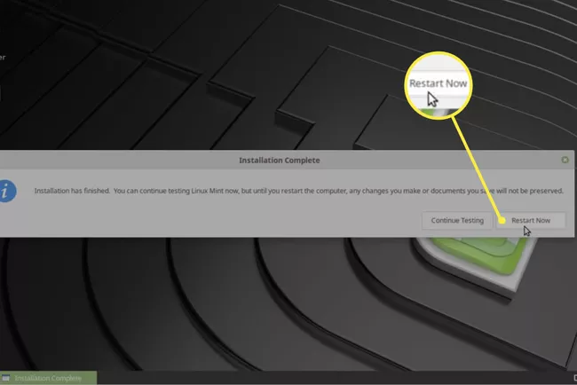
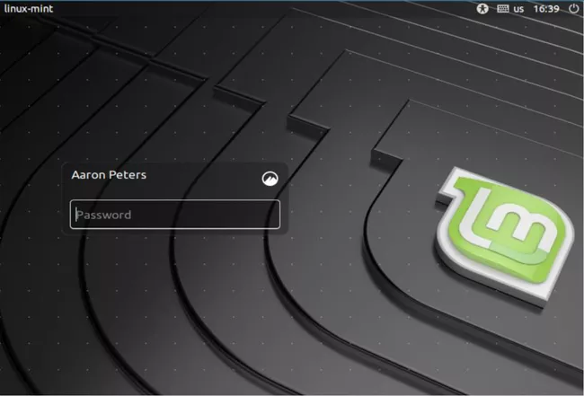

# Installing Linux Mint

For this process we are going for straight installation. We need to make sure we have all the alternatives apps we need before switching to linux. 

---

### Step 1: Choose Language

---

### Step 2: Choose Your Keyboard Type

---

### Step 3: Install Third Party Software

---

### Step 4: Erase Disk and Install Linux Mint

---

### Step 5: Select The Time Zone

---

### Step 6: Enter Your Details

---

### Step 7: The Installer Will Start To Install The Operating System

---

### Step 8: Restart Your PC

---

### Step 9: Enter Your Login Details

