# LINUX Basix Commands

### **Navigation** 

1. **pwd**

    pwd stands for **present working directory**, and will print the path to your current directory.
    
    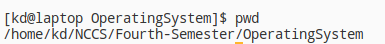

2. **dir**

    dir prints all the available directories in the present working directory

    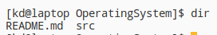

3. **ls**

    ls will give you a list of names of files and directories.

    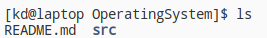

4. **cd**

    cd will change the your new current working directory to the directory you specified.

    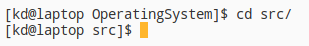

5. **touch**

    touch command is used to create a new file.

    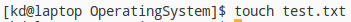

6. **cat**

    cat command is used to show the content of any file.

    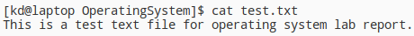

7. **mkdir**

    mkdir will create new directory in our current working directory.

    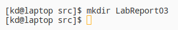

8. **rm**

    rm deletes the directory and files.

    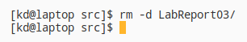

9. **cp**

    cp command is used to copy any file or folder.

    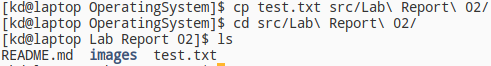

10. **mv**

    mv command is used to move any file or folder and you can even rename files or directory inside a specific directory.

    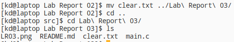

    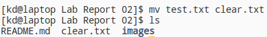

11. **pacman**

    pacman is a package manager in Arch which installs, removes or updates packages in arch. pacman requires sudo privileges to successfully execute the command.

    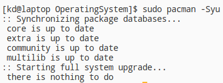