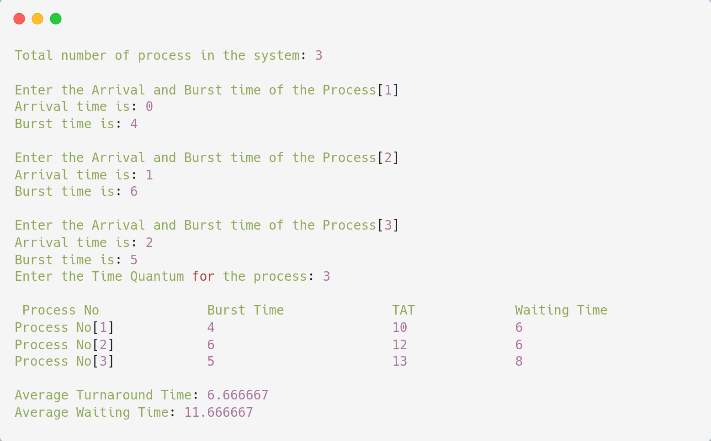

# Round Robin Scheduling Algorithm

## Algorithm

    1. Start

    2. Create an array rem_bt[] to keep track of remaining burst time of processes. This array is initially a copy of bt[] (burst times array)

    3. Create another array wt[] to store waiting times of processes. Initialise this array as 0.

    4. Initialise time : t = 0

    5. Keep traversing the all processes while all processes are not done. Do following for i'th process if it is not done yet.
    - If rem_bt[i] > quantum
        i. t = t + quantum
        ii. rem_bt[i] -= quantum;
    -Else // Last cycle for this process
        i. t = t + rem_bt[i];
        ii. wt[i] = t - bt[i]
        iii. rem_bt[i] = 0; // This process is over

    6. Stop

---

## Source Code

```c
#include<stdio.h>  

void main(){  
    int i, NOP, sum=0,count=0, y, quant, wt=0, tat=0, at[10], bt[10], temp[10];  
    float avg_wt, avg_tat;  
    
    printf("Total number of process in the system: ");  
    scanf("%d", &NOP);  
    
    y = NOP;

    for(i=0; i<NOP; i++){  
        printf("\nEnter the Arrival and Burst time of the Process[%d]\n", i+1);  

        printf("Arrival time is: ");  
        scanf("%d", &at[i]);  

        printf("Burst time is: ");  
        scanf("%d", &bt[i]);  

        temp[i] = bt[i]; 
    }

    printf("Enter the Time Quantum for the process: ");  
    scanf("%d", &quant);  
    
    printf("\n Process No \t\t Burst Time \t\t TAT \t\t Waiting Time ");  
    for(sum = 0, i = 0; y!=0; ){  
        if(temp[i] <= quant && temp[i] > 0){  
            sum = sum + temp[i];  
            temp[i] = 0;  
            count=1;  
        }else if(temp[i] > 0){  
            temp[i] = temp[i] - quant;  
            sum = sum + quant;    
        }  
        if(temp[i]==0 && count==1){  
            y--;
            printf("\nProcess No[%d] \t\t %d\t\t\t %d\t\t %d", i+1, bt[i], sum-at[i], sum-at[i]-bt[i]);  
            wt = wt+sum-at[i]-bt[i];  
            tat = tat+sum-at[i];  
            count =0;     
        }  
        if(i==NOP-1) i=0;  
        else if(at[i+1]<=sum) i++;  
        else i=0;   
    }  
    
    avg_wt = wt * 1.0/NOP;  
    avg_tat = tat * 1.0/NOP;  
    
    printf("\n\nAverage Turnaround Time: %f", avg_wt);  
    printf("\nAverage Waiting Time: %f\n", avg_tat);    
}      
```

---

## Output



---
