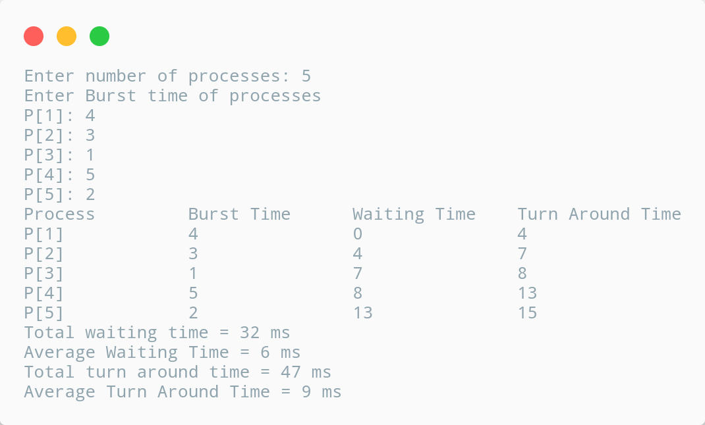

# FCFS Scheduling.

## Description

To calculate the average waiting time using the FCFS algorithm first the waiting time of the first process is kept zero and the waiting time of the second process is the burst time of the first process and the waiting time of the third process is the sum of the bursty times of the first and the second process and so on. After calculating all the waiting times the average waiting time is calculated as the average of all the waiting times. FCFS mainly says first come first sevre the algorithm which came first will be served first.

---

## Algorithm

    1. Start

    2. Accept the number of processes in the ready queue.

    3. For each process in the ready Q, assign the process name and the burst time.

    4. Set the waiting of the first process as 0 and its burst time as its turnaround time.

    5. For each process in the Ready Q calculate:

        a. waiting_time (n) = waiting_time(n - 1) + burst_time(n - 1)
        b. turnaround_time (n) = waiting_time(n) + burst_time(n)

    6. Calculate:

        a. average_waiting_time = total_waiting_time / number_of_process
        b. average_turnaround_time = total_turnaround_time / number_of_process

    7. Stop

---

## Source Code

```c
// C program for implementation of FCFS scheduling
#include <stdio.h>

int main(){
    int n, i, j, burst_time[10], waiting_time[10], turn_around_time[10], total_waiting_time = 0, total_turn_around_time = 0, avg_waiting_time = 0, avg_turn_around_time = 0;
    printf("Enter number of processes: ");
    scanf("%d", &n);

    printf("\nEnter Burst time of processes\n");
    for(i = 0; i < n; i++){
        printf("P[%d]: ", i + 1);
        scanf("%d", &burst_time[i]);
    }

    waiting_time[0] = 0;
    for(i = 1; i < n; i++){
        waiting_time[i] = 0;
        for(j = 0; j < i; j++){
            waiting_time[i] = waiting_time[i] + burst_time[j];
        }
    }

    printf("\nProcess\t\tBurst Time\tWaiting Time\tTurn Around Time\n");
    for(i = 0; i < n; i++){
        turn_around_time[i] = burst_time[i] + waiting_time[i];
        total_waiting_time += waiting_time[i];
        total_turn_around_time += turn_around_time[i];
        printf("P[%d]\t\t%d\t\t%d\t\t%d\n", i + 1, burst_time[i], waiting_time[i], turn_around_time[i]);
    }

    avg_waiting_time = total_waiting_time / n;
    avg_turn_around_time = total_turn_around_time / n;
    printf("\nTotal waiting time = %d ms\n", total_waiting_time);
    printf("\nAverage Waiting Time = %d ms\n", avg_waiting_time);
    printf("\nTotal turn around time = %d ms\n", total_turn_around_time);
    printf("\nAverage Turn Around Time = %d ms\n", avg_turn_around_time);
    return 0;
}
```

---

## Output



---

## Links

[][replit]
[][github]

[replit]: https://replit.com/@kabirdeula/FCFS-Scheduling
[github]: https://github.com/kabirdeula/OperatingSystemLabReport/blob/main/src/Lab%20Report%2003/main.c