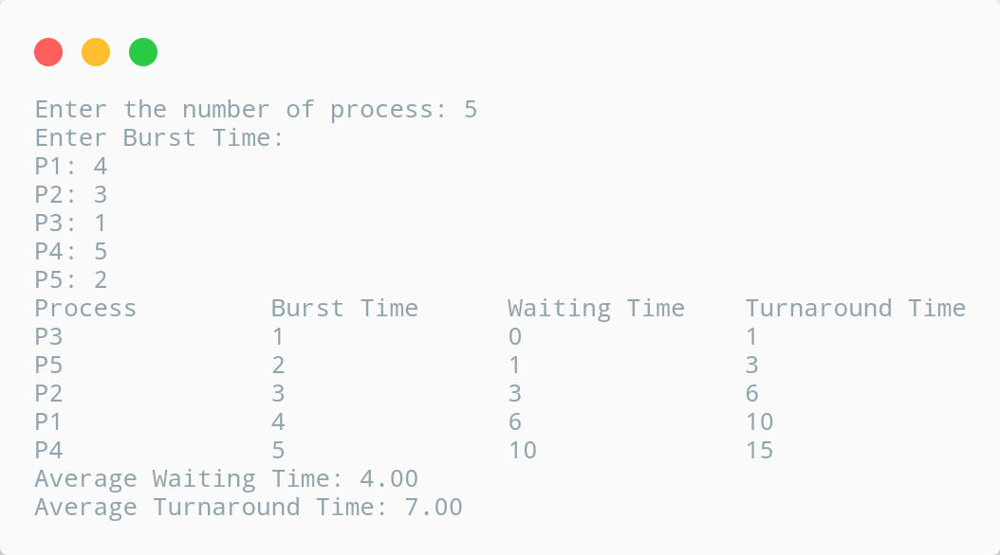

# Shortest Job First (SJF) Scheduling

## Description

To calculate the average waiting time in the shortest job first algorithm the sorting of the process based on their burst time in ascending order then calculate the waiting time of each process as the sum of the bursting times of all the process previous or before to that process.

---

## Algorithm

    1. Start

    2. Accept the number of process in the ready queue.

    3. For each process in the ready Q, assign the process id and accept the CPU burst time.

    4. Start the Ready Q according to the shortest Burst Time by sorting according to lowest to highest burst time.

    5. Set the waiting time of the first process as 0 and its turnaround time as its burst time.

    6. Sort the process names based on their burst time.

    7. For ewach process in the ready queue, calculate:

        a. waiting_time(n) = total_waiting_time / number_of_process

        b. turnaround_time(n) = waiting_time(n) + burst_time(n)

        c. average_waiting_time = total_waiting_time / number_of_process

        d. average_turnaround_time = total_turnaround_time / number_of_process
    
    8. Stop

***

## Source Code

```c
// C Program for SJF Scheduling

#include <stdio.h>

int main(){
    int burst_time[20], process[20], waiting_time[20], turnaround_time[20], i, j, n, total = 0, pos, temp;
    float avg_waiting_time, avg_turnaround_time;

    printf("\nEnter the number of process: ");
    scanf("%d", &n);

    printf("\nEnter Burst Time:\n");
    for (i = 0; i < n; i++){
        printf("P%d: ", i + 1);
        scanf("%d", &burst_time[i]);
        process[i] = i + 1;
    }

    // Sorting burst time in ascending order using selection sort.
    for (i = 0; i < n; i++){
        pos = i;
        for (j = i + 1; j < n; j++){
            if (burst_time[j] < burst_time[pos]) pos = j;
        }
        temp = burst_time[i];
        burst_time[i] = burst_time[pos];
        burst_time[pos] = temp;

        temp = process[i];
        process[i] = process[pos];
        process[pos] = temp;
    }

    waiting_time[0] = 0; // Waiting time for first process will be zero.

    // Calculating waiting time
    for (i = 1; i < n; i++){
        waiting_time[i] = 0;
        for (j = 0; j < i; j++) waiting_time[i] += burst_time[j];
        total += waiting_time[j];
    }

    avg_waiting_time = (float)total / n;
    total = 0;
    
    printf("\nProcess\t\tBurst Time\tWaiting Time\tTurnaround Time");
    for (i = 0; i < n; i++){
        turnaround_time[i] = burst_time[i] + waiting_time[i];
        total += turnaround_time[i];
        printf("\nP%d\t\t%d\t\t%d\t\t%d", process[i], burst_time[i], waiting_time[i], turnaround_time[i]);
    }

    avg_turnaround_time = (float)total / n;

    printf("\n\nAverage Waiting Time: %.2f", avg_waiting_time);
    printf("\nAverage Turnaround Time: %.2f\n\n", avg_turnaround_time);

    return 0;
}
```
---

## Output



***

## Links

[][replit]
[][github]

[replit]: https://replit.com/@kabirdeula/SJF-Scheduling
[github]: https://github.com/kabirdeula/OperatingSystemLabReport/blob/main/src/Lab%20Report%2004/main.c