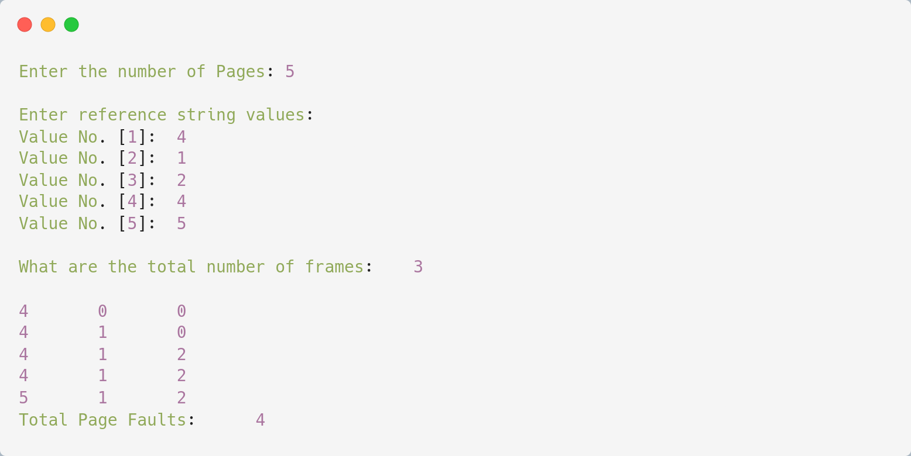

# FIFO Page Replacement

## Algorithm
    
    1. Start

    2. If the memory holds fewer pages, then the capacity goes to step 5.

    3. Push pages in the queue one at a time until the queue reaches its maximum capacity or all page requests are fulfilled.
 
    4. If the current page is present in the memory, do nothing.
    
    5. Else, pop the topmost page from the queue as it was inserted first.
 
    6. Replace the topmost page with the current page from the string.
 
    7. Increment the page faults.
 
    8. Stop
---

## Source Code

```c
#include <stdio.h>

int main(){
    int incomingStream[] = {4, 1, 2, 4, 5};
    int pageFaults = 0;
    int frames = 3;
    int m, n, s, pages;

    pages = sizeof(incomingStream)/sizeof(incomingStream[0]);

    printf("Incoming \t Frame 1 \t Frame 2 \t Frame 3");
    int temp[frames];
    for(m = 0; m < frames; m++){
        temp[m] = -1;
    }

    for(m = 0; m < pages; m++){
        s = 0;

        for(n = 0; n < frames; n++){
            if(incomingStream[m] == temp[n]){
                s++;
                pageFaults--;
            }
        }
        pageFaults++;
        
        if((pageFaults <= frames) && (s == 0)){
            temp[m] = incomingStream[m];
        }else if(s == 0){
            temp[(pageFaults - 1) % frames] = incomingStream[m];
        }
      
        printf("\n");
        printf("%d\t\t",incomingStream[m]);
        for(n = 0; n < frames; n++){
            if(temp[n] != -1) printf(" %d\t\t", temp[n]);
            else printf(" - \t\t");
        }
    }

    printf("\nTotal Page Faults:\t%d\n", pageFaults);
    return 0;
}
```

---

## Output


