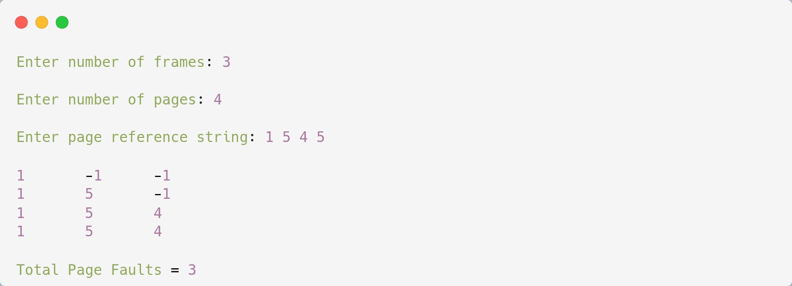

# Optimal Page Replacement

## Algorithm

    1. Start

    2. Push the first page in the stack as per the memory demand.

    3. Push the second page as per the memory demand.

    4. Push the third page until the memory is full.

    5. As the queue is full, the page which is least recently used is popped.

    6. Repeat step 4 until the page demand continues and until the processing is over.

    7. Stop
    
---

## Source Code

```c
#include<stdio.h>

int main(){
    int no_of_frames, no_of_pages, frames[10], pages[30], temp[10], flag1, flag2, flag3, i, j, k, pos, max, faults = 0;
    printf("\nEnter number of frames: ");
    scanf("%d", &no_of_frames);

    printf("\nEnter number of pages: ");
    scanf("%d", &no_of_pages);

    printf("\nEnter page reference string: ");

    for(i = 0; i < no_of_pages; ++i) scanf("%d", &pages[i]);

    for(i = 0; i < no_of_frames; ++i) frames[i] = -1;

    for(i = 0; i < no_of_pages; ++i){
        flag1 = flag2 = 0;

        for(j = 0; j < no_of_frames; ++j){
            if(frames[j] == pages[i]){
                   flag1 = flag2 = 1;
                   break;
               }
        }

        if(flag1 == 0){
            for(j = 0; j < no_of_frames; ++j){
                if(frames[j] == -1){
                    faults++;
                    frames[j] = pages[i];
                    flag2 = 1;
                    break;
                }
            }    
        }

        if(flag2 == 0){
            flag3 =0;

            for(j = 0; j < no_of_frames; ++j){
                temp[j] = -1;

                for(k = i + 1; k < no_of_pages; ++k){
                    if(frames[j] == pages[k]){
                        temp[j] = k;
                        break;
                    }
                }
            }

            for(j = 0; j < no_of_frames; ++j){
                if(temp[j] == -1){
                    pos = j;
                    flag3 = 1;
                    break;
                }
            }

            if(flag3 ==0){
                max = temp[0];
                pos = 0;

                for(j = 1; j < no_of_frames; ++j){
                    if(temp[j] > max){
                        max = temp[j];
                        pos = j;
                    }
                }               
            }

            frames[pos] = pages[i];
            faults++;
        }

        printf("\n");

        for(j = 0; j < no_of_frames; ++j) printf("%d\t", frames[j]);
    }

    printf("\n\nTotal Page Faults = %d\n", faults);

    return 0;
} 
```

---

## Output



---