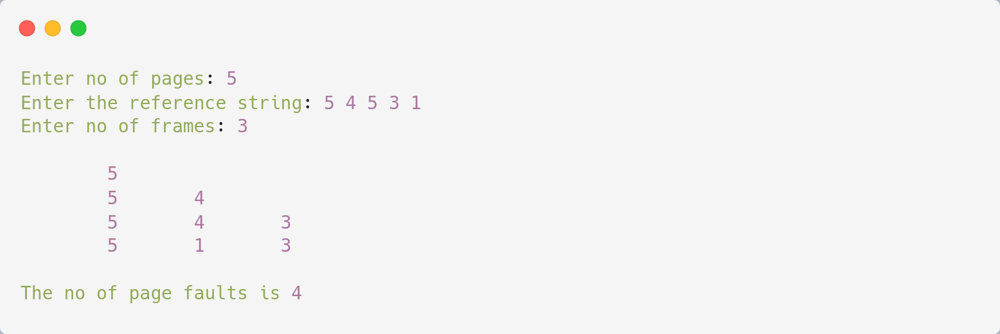

# LRU Page Replacement

## Algorithm

    1. Start

    2. Declare the size

    3. Get the number of pages to be inserted

    4. Get the value

    5. Declare counter and stack

    6. Select the least recently used page by counter value

    7. Stack them according to the selection.

    8. Display the values

    9. Stop
---

## Source Code

```c
#include<stdio.h>

int main(){
    int q[20],p[50],c=0,c1,d,f,i,j,k=0,n,r,t,b[20],c2[20];
    
    printf("Enter no of pages: ");
    scanf("%d",&n);
    
    printf("Enter the reference string: ");
    for(i=0;i<n;i++) scanf("%d",&p[i]);
    
    printf("Enter no of frames: ");
    scanf("%d",&f);
    q[k]=p[k];
    printf("\n\t%d\n",q[k]);
    c++;
    k++;
    for(i=1;i<n;i++){
        c1=0;
        for(j=0;j<f;j++) if(p[i]!=q[j]) c1++;
        if(c1==f){
            c++;
            if(k<f){
                q[k]=p[i];
                k++;
                for(j=0;j<k;j++) printf("\t%d",q[j]);
                printf("\n");
            }else{
                for(r=0;r<f;r++){
                    c2[r]=0;
                    for(j=i-1;j<n;j--){
                        if(q[r]!=p[j]) c2[r]++;
                        else break;
                    }
                }
                for(r=0;r<f;r++) b[r]=c2[r];
                for(r=0;r<f;r++){
                    for(j=r;j<f;j++){
                        if(b[r]<b[j]){
                            t=b[r];
                            b[r]=b[j];
                            b[j]=t;
                        }
                    }
                }
                for(r=0;r<f;r++){
                    if(c2[r]==b[0]) q[r]=p[i];
                    printf("\t%d",q[r]);
                }
                printf("\n");
            }
        }
    }
    printf("\nThe no of page faults is %d\n",c);
}  
```

---

## Output

