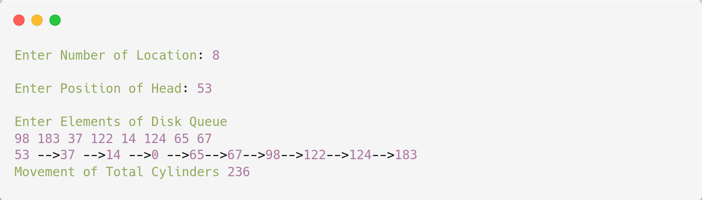

# SCAN Disk Scheduling

## Source Code

```c
#include<stdio.h>

int main(){
    int i, j, sum=0, n, d[20], disk, temp, max = 0, dloc;

    printf("\nEnter Number of Location: ");
    scanf("%d", &n);
    
    printf("\nEnter Position of Head: ");
    scanf("%d", &disk);
    
    printf("\nEnter Elements of Disk Queue\n");
    for (i = 0; i < n; i++) scanf("%d", &d[i]);
    
    d[n] = disk;
    n++;
    for (i = 0; i < n; i++){
        for (j = i; j < n; j++){
            if(d[i] > d[j]){
            temp = d[i];
            d[i] = d[j];
            d[j] = temp;
            }
        }
    }

    max=d[n];
    for (i = 0; i < n; i++){
        if(disk == d[i]){ 
            dloc = i; 
            break; 
        }
    }

    for(i = dloc; i >= 0; i--) printf("%d -->", d[i]);
    printf("0 -->");
    for(i = dloc + 1; i < n; i++) printf("%d-->", d[i]);
    sum=disk+max;
    
    printf("\nMovement of Total Cylinders %d\n", sum);
    return 0;
} 
```

---

## Output



---
