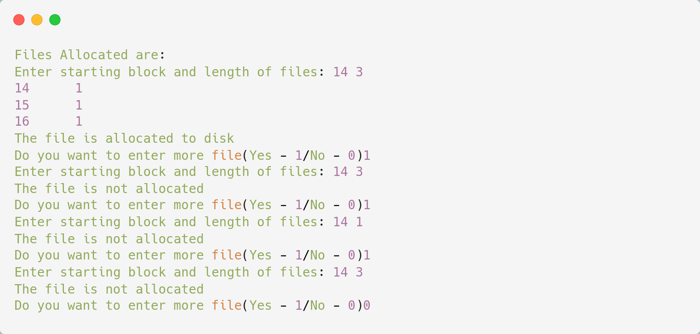

# Sequential File Allocation

## Algorithm

    1. Start.
    
    2. Get the number of memory partition and their sizes.
    
    3. Get the number of processes and values of block size for each process.
    
    4. First fit algorithm searches all the entire memory block until a hole which is big enough is encountered. It allocates that memory block for the requesting process.
    
    5. Best-fit algorithm searches the memory blocks for the smallest hole which can be allocated to requesting process and allocates it.
    
    6. Worst fit algorithm searches the memory blocks for the largest hole and allocates it to the process.
    
    7. Analyses all the three memory management techniques and display the best algorithm which utilizes the memory resources effectively and efficiently.
    
    8. Stop.

## Source Code

```c
#include <stdio.h>
#include<stdlib.h>

void main(){
    int f[50], i, st, len, j, c, k, count = 0;
    for (i = 0; i < 50; i++) f[i]=0;
    printf("Files Allocated are:\n");
    x: count=0;
    
    printf("Enter starting block and length of files: ");
    scanf("%d%d", &st,&len);
    
    for (k = st; k < (st + len); k++) if(f[k] == 0) count++;
    
    if (len == count){
        for (j = st; j < (st + len); j++)
            if (f[j] == 0){
            f[j] = 1;
            printf("%d\t%d\n", j, f[j]);
            }
        if(j != (st + len - 1)) printf("The file is allocated to disk\n");
    }else printf("The file is not allocated \n");
    printf("Do you want to enter more file(Yes - 1/No - 0)");
    scanf("%d", &c);
    if(c==1) goto x;
    else exit(1);
}
```

## Output

