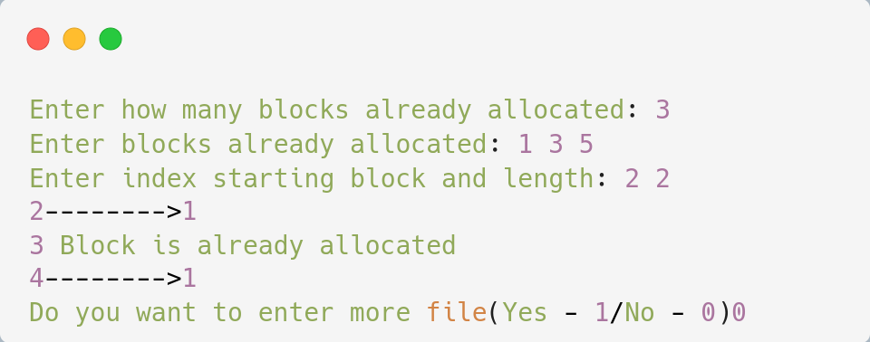

# Linked File Allocation

## Algorithm

    1. Start.

    2. Create a queue to hold all pages in memory
    
    3. When the page is required replace the page at the head of the queue
    
    4. Now the new page is inserted at the tail of the queue
    
    5. Create a stack
    
    6. When the page fault occurs replace page present at the bottom of the stack
    
    7. Stop the allocation.

## Source Code

```c
#include<stdio.h>
#include<stdlib.h>

void main(){
    int f[50], p,i, st, len, j, c, k, a;
    
    for (i = 0; i < 50; i++) f[i] = 0;
    
    printf("Enter how many blocks already allocated: ");
    scanf("%d", &p);
    
    printf("Enter blocks already allocated: ");
    for (i = 0; i < p; i++){
        scanf("%d", &a);
        f[a] = 1;
    }

    x: printf("Enter index starting block and length: ");
    scanf("%d%d", &st, &len);
    k = len;

    if (f[st] == 0){
        for (j = st; j < (st + k); j++){
            if (f[j] == 0){
                f[j] = 1;
                printf("%d-------->%d\n", j, f[j]);
            }else{
                printf("%d Block is already allocated \n", j);
                k++;
            }
        }
    }else printf("%d starting block is already allocated \n", st);
    
    printf("Do you want to enter more file(Yes - 1/No - 0)");
    scanf("%d", &c);
    
    if(c==1) goto x;
    else exit(0);
}
```

## Output

