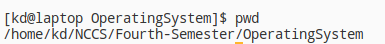
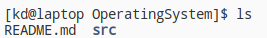
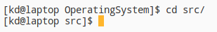
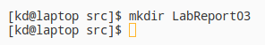
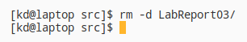

# LINUX Basix Commands

### **Navigation** 

1. **pwd**

    pwd stands for **print working directory**, and will print the path to your current directory.
    
    

2. **ls**

    ls will give you a list of names of files and directories.

    

3. **cd**

    cd will change the your new current working directory to the directory you specified.

    

4. **mkdir**

    mkdir will create new directory in our current working directory.

    

5. **rm**

    rm deletes the directory and files.

    
